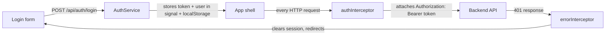

# Frontend Development Plan — Angular 21

This document is the reference for building the frontend, the same way [DATABASE.md](DATABASE.md) is the reference for the schema. It describes *what* to build and *why*, not the code itself — see [CLAUDE.md](../CLAUDE.md) for the experience-level and scope guardrails this plan is written under (plain, explicit, textbook Angular; no state-management library, no premature abstraction).

The backend is functionally complete (see [TASKS.md](../TASKS.md)); this plan treats its controllers and DTOs as a fixed contract and works backward from them, rather than guessing at shapes.

## Goals

- Cover every screen the brief's **Frontend Requirements** lists: Login/Logout, Dashboard, Role-based Navigation, Branch/Book/Member Management, Borrow & Return, Reservation Queue, Reports, Responsive UI.
- Mirror the backend's module boundaries 1:1 — one feature area per controller, so the mental model stays simple and each screen's data needs map to one obvious set of endpoints.
- Keep every pattern one a ~2-year Angular developer would recognize and could defend in an interview: standalone components, signals for local/UI state, Reactive Forms, a thin typed API service per module. No NgRx, no custom RxJS operators, no generic "framework" abstractions.

## Tech stack & key decisions

| Concern | Decision | Why |
|---|---|---|
| Framework | Angular 21, standalone components (no `NgModule`s) | Standalone has been the default app shape since v19; there's no reason to reach for the older module system. |
| Change detection | Default zone.js (not zoneless) | Zoneless is still a newer opt-in pattern; default zone.js is the stable, textbook choice for this scope. |
| Components | **Signal-based**: `input()` / `output()` / `model()` instead of `@Input()`/`@Output()` decorators, `computed()` for derived view state, local UI state (selected row, open/closed dialog, current tab) held directly as `signal()`s on the component | Current Angular idiom (stable since 17.1) — a component's own state and its props read like plain variables instead of decorator boilerplate, which is easier to reason about at this experience level, not harder. |
| State | Feature-level **signals**, held in a small `@Injectable` service per feature (not a store library) | The app's state needs (a list, a filter, a selected item, a loading flag) don't justify NgRx/Akita. Matches the project's "don't add abstraction beyond what's needed" rule. |
| Forms | **Reactive Forms** (`FormGroup`/`FormControl`), status/value read back into the component via `toSignal()` where the template needs it reactively | Textbook, stable approach for anything with validation; template-driven forms don't scale past a couple of fields, and the experimental Signal Forms API isn't stable in Angular 21 — not worth the risk this round. Combining `FormGroup` with `toSignal()` keeps the component itself signal-driven without adopting an experimental forms API. |
| HTTP | `HttpClient` with **functional interceptors** (`withInterceptors`), one API service class per backend module | Matches the backend's one-controller-per-module shape; each service method maps to exactly one endpoint. |
| Async → template | `toSignal()` where a call feeds a template directly; otherwise plain `subscribe()` in the component for one-off actions (create/update/delete) | Avoids sprinkling `async` pipes and manual subscriptions inconsistently; keeps templates reading from signals everywhere, not a mix of signals and observables. |
| UI component library | **ng-bootstrap** (`@ng-bootstrap/ng-bootstrap`) — Bootstrap 5 components as Angular directives/components (modal, pagination, toast, nav/offcanvas, dropdown), no Angular Material | Explicit project choice. Gives the interactive pieces (modal, pagination, toast) as accessible Angular components without hand-rolling them, while everything else (layout, tables, forms, cards) is plain Bootstrap 5 HTML/CSS classes the developer already knows. |
| Styling | Plain **HTML + CSS**, Bootstrap 5 for grid/utilities/components, one SCSS override file setting Bootstrap's `$primary` (and related theme variables) to the project brand color **`#8442c7`** before importing Bootstrap | No component-library theming system (no Material M3 theming) to learn — overriding a handful of Bootstrap Sass variables is the standard, textbook way to brand a Bootstrap app. |
| Control flow | New `@if` / `@for` / `@switch` syntax | Current Angular idiom; `*ngIf`/`*ngFor` are legacy. |

## Project structure

```
library-management-ui/
├── src/
│   ├── app/
│   │   ├── core/                    # app-wide, singleton concerns
│   │   │   ├── auth/                 # AuthService, auth state (signals), login/logout
│   │   │   ├── interceptors/         # auth (bearer token), error handling
│   │   │   ├── guards/               # authGuard, roleGuard
│   │   │   └── layout/               # shell: top bar, side nav, role-based menu
│   │   ├── shared/                   # dumb, reusable pieces used by 2+ features
│   │   │   ├── components/           # data-table, paginator wrapper, confirm-dialog, page-header, empty-state
│   │   │   ├── models/               # shared DTO interfaces (PagedResult<T>, ApiError)
│   │   │   └── pipes/                # e.g. status-badge formatting
│   │   ├── features/
│   │   │   ├── branches/
│   │   │   ├── books/                # includes nested "copies" view
│   │   │   ├── members/
│   │   │   ├── borrow-return/
│   │   │   ├── reservations/
│   │   │   ├── reports/
│   │   │   └── dashboard/
│   │   ├── app.routes.ts
│   │   └── app.config.ts
│   ├── environments/
│   │   ├── environment.ts             # dev: API base URL http://localhost:5179/api (or the https port)
│   │   └── environment.production.ts
│   └── styles/                        # Bootstrap import + brand color ($primary: #8442c7) override + global layout CSS
```

Each `features/<module>/` folder holds that module's list page, create/edit form, and its own API service + signal-based state service — kept local to the feature rather than promoted to `core/` unless something is genuinely shared.

## Routing plan

Lazy-loaded per feature (`loadComponent`/`loadChildren`), guarded as follows:

| Route | Component | Guard | Notes |
|---|---|---|---|
| `/login` | Login page | — (public) | Redirects to `/dashboard` if already authenticated |
| `/dashboard` | Dashboard | `authGuard` | Landing page after login |
| `/branches` | Branch list | `authGuard` | View: both roles. Create/Edit/Delete UI only rendered for Admin |
| `/branches/new`, `/branches/:id/edit` | Branch form | `authGuard` + `roleGuard('Admin')` | Matches backend `[Authorize(Roles = "Admin")]` on mutations |
| `/books` | Book list | `authGuard` | Both roles, full CRUD |
| `/books/:id` | Book detail (incl. per-branch copies) | `authGuard` | Nested copies list + "add stock" form |
| `/members` | Member list | `authGuard` | Both roles, full CRUD |
| `/borrow-return` | Borrow & Return workspace | `authGuard` | Checkout form + active-loans list with return action |
| `/reservations` | Reservation queue | `authGuard` | Create + queue list with cancel/fulfill actions |
| `/reports` | Reports | `authGuard` | Three report views (tabs or sub-routes) |
| `/users/register` | Staff registration form | `authGuard` + `roleGuard('Admin')` | Maps to `POST /api/auth/register` |
| `**` | Not-found / redirect to dashboard | — | |

`authGuard` checks the signal-based auth state (is a valid, non-expired token present); `roleGuard` is a guard factory taking the required role(s) and checking the decoded JWT role claim. Both are functional guards (`CanActivateFn`), not class-based — the current Angular idiom.

## Authentication & authorization flow



- **Token storage**: `localStorage`, under a single key holding the token, its `expiresAt`, and the decoded `UserDto` (from `LoginResultDto`). Assumption, documented here per project convention: simplest option for a role/JWT setup with no refresh token; acceptable for this assessment's scope (matches the backend's own "single 60-minute JWT, no refresh token" design).
- **`AuthService`** exposes signals for `currentUser`, `isAuthenticated`, and `role`, derived from what's in storage at startup (`APP_INITIALIZER`/`provideAppInitializer` reads it back in before the router activates the first guard).
- **`authInterceptor`**: attaches `Authorization: Bearer <token>` to every outgoing request except `/auth/login`.
- **`errorInterceptor`**: on a `401`, clears stored auth state and redirects to `/login`; on `403`, `404`, `409`, and validation `400`s, surfaces the backend's `{ message, errors }` payload (see **Error handling** below) rather than a generic failure.
- **Session expiry**: since there's no refresh token, a token that expires mid-session simply fails the next request with `401` and the user is bounced to login — no silent-refresh complexity, consistent with the backend's own scope decision.
- **Logout**: clears the stored session and navigates to `/login`; no server-side call needed (backend has no logout/revoke endpoint — JWTs are stateless).
- **`GET /api/auth/me`**: not used for the login flow itself (login already returns the full `UserDto`), but is available to re-validate/refresh the displayed user info, e.g. after a page reload if a decision is made to trust the server over the cached copy.

## Role-based navigation

Two roles exist: `Admin`, `Librarian`. Per the backend's own role split (documented in [README.md](../README.md)):

- **Both roles** see and use: Dashboard, Books, Members, Borrow & Return, Reservations, Reports.
- **Admin only**: Branches (create/edit/delete — list/view is open to both), Staff Registration.

The side nav renders its full item list always, but Admin-only items are conditionally included based on the `role` signal from `AuthService` (`@if (auth.role() === 'Admin')`), and the corresponding routes are additionally locked down by `roleGuard` — so hiding a nav item is a UX nicety, not the security boundary. The real boundary is the guard (client-side) backed by the API's own `[Authorize(Roles = "Admin")]` (server-side, authoritative).

## API integration layer

One `@Injectable` service per backend controller, each method mapping to exactly one endpoint. All list endpoints return `PagedResult<T>` (`{ items, totalCount, pageNumber, pageSize }`); all error responses share one shape (`{ message, errors }`, `errors` populated only for validation failures) — both are modeled once as shared interfaces in `shared/models/` and reused everywhere, rather than redefined per feature.

| Service | Endpoints |
|---|---|
| `AuthApiService` | `POST /auth/login`, `POST /auth/register`, `GET /auth/me` |
| `BranchesApiService` | `GET/POST /branches`, `GET/PUT/DELETE /branches/{id}` |
| `BooksApiService` | `GET/POST /books`, `GET/PUT/DELETE /books/{id}`, `GET/POST /books/{id}/copies` |
| `MembersApiService` | `GET/POST /members`, `GET/PUT/DELETE /members/{id}` |
| `BorrowRecordsApiService` | `GET /borrowrecords` (filters: `memberId`, `branchId`, `status`), `GET /borrowrecords/{id}`, `POST /borrowrecords` (checkout), `POST /borrowrecords/{id}/return` |
| `ReservationsApiService` | `GET /reservations` (filters: `memberId`, `bookId`, `branchId`, `status`), `GET /reservations/{id}`, `POST /reservations`, `POST /reservations/{id}/cancel`, `POST /reservations/{id}/fulfill` |
| `ReportsApiService` | `GET /reports/overdue-books` (`branchId?`), `GET /reports/most-borrowed-books` (`branchId?`, `top?`), `GET /reports/branch-inventory-summary` |

All list endpoints take `search`/filter query params plus `pageNumber`/`pageSize` (backend caps `pageSize` at 100) — the shared data-table component (below) standardizes how a feature passes these through and reads back `PagedResult<T>`.

Note: `ProcessedByUserId` on borrow/return and reservation-fulfillment is derived server-side from the JWT — the frontend never sends it, matching the backend's explicit "client can't spoof who processed the transaction" rule.

## State management approach

Each feature gets a small state service holding **signals**, not a global store:

- A `list` signal (current page of results), `totalCount`, `loading`, and the active filter/search/page values.
- A method that calls the matching `ApiService`, and on response updates the signals — called from the list component on init and whenever a filter/page changes.
- Create/update/delete actions call the API directly from the component (or a thin method on the same service) and, on success, re-trigger the list load rather than trying to patch local state in place — simpler and always consistent with the server.

This intentionally does not introduce a shared "app-wide entity cache" — each feature loads what it needs, when it needs it. Given the CRUD-heavy, page-at-a-time nature of every screen here, a caching layer would be the kind of premature abstraction the project explicitly avoids.

## Screens

| Screen | Roles | Key elements |
|---|---|---|
| **Login** | Public | Username + password form, validation, error banner on `401` |
| **Dashboard** | Both | Small role-aware summary — counts pulled from existing list/report endpoints (e.g. total books, total members, open reservations, overdue count via `overdue-books`) rather than a dedicated summary endpoint (none exists); a landing page, not a new backend requirement |
| **Branches** | View: both; Manage: Admin | Searchable/paginated table; create/edit form (name, address, phone, email); delete blocked server-side with `409` if referenced — surfaced as an error message, not hidden client-side |
| **Books** | Both | Searchable/paginated table (title/author/ISBN); create/edit form; book detail view showing per-branch copies with an "add stock" action (`POST /books/{id}/copies`) |
| **Members** | Both | Searchable/paginated table (name/email) with branch filter; create/edit form; delete blocked server-side if borrow/reservation history exists |
| **Borrow & Return** | Both | Checkout form (select member, book, branch → `POST /borrowrecords`); filterable list (member/branch/status) with an overdue visual indicator (`IsOverdue` from the DTO) and a "Return" action per row |
| **Reservation Queue** | Both | Create-reservation form; filterable queue list (member/book/branch/status) showing `queuePosition`; "Cancel" and "Fulfill" row actions (fulfill only sensible on the front-of-queue item — server enforces this, UI can just surface the server's rejection if attempted out of turn) |
| **Reports** | Both | Three views/tabs: Overdue Books, Most Borrowed Books (with a top-N input), Branch Inventory Summary — each a read-only filterable table over its report endpoint |
| **Staff Registration** | Admin | Form for `POST /auth/register` (username, email, password, full name, role, branch) |

## Shared components

Built once in `shared/components/`, reused across every feature list screen:

- **Data table** — a plain HTML `<table>` styled with Bootstrap's `table`/`table-hover`/`table-responsive` classes, driven generically by a `PagedResult<T>` and a column-definition input, paired with ng-bootstrap's `NgbPagination` for page controls — every list screen (Branches, Books, Members, Borrow records, Reservations, Reports) uses the same component instead of six bespoke tables.
- **Search/filter bar** — a Bootstrap form row (text input, debounced) plus a slot for feature-specific filter controls (e.g. branch `<select>`, status `<select>`), styled with Bootstrap form classes.
- **Confirm dialog** — for delete actions, built on ng-bootstrap's `NgbModal`.
- **Toast service** — thin wrapper around ng-bootstrap's `NgbToast`, driven by a small signal-based "current toasts" list service, for success/error notifications fed by the error interceptor and by successful create/update/delete actions.
- **Page header** — title + primary action button, laid out with Bootstrap flex utilities, consistent spacing across feature pages.
- **Empty/loading states** — a small spinner (Bootstrap's `spinner-border`) or "no results" block, shown while a list signal's `loading` is true or its `items` is empty, instead of each screen reinventing this.

## Validation strategy

Reactive Forms with Angular's built-in validators (`required`, `email`, `minLength`, `pattern` for ISBN, etc.) mirror the backend's FluentValidation rules so obviously-invalid input is caught before a round trip. The backend remains the source of truth: on a `400` with a populated `errors` map, the form maps each key back to its matching control and displays the server's message — so validation isn't silently duplicated and can't drift from the backend rules.

## Error handling & UX conventions

- Field-level errors (validation `400`s): shown inline under the relevant form control.
- Everything else (`404`, `409`, `401` after redirect, `500`): shown as a toast using the backend's `message` field directly — the backend already writes user-appropriate messages (e.g. delete-guard conflicts), so the frontend doesn't need to re-interpret status codes into new copy.
- Loading states: a spinner/skeleton on first load, a disabled/pending state on submit buttons during in-flight requests (prevents double-submit on checkout/create actions in particular).

## Responsive design

Bootstrap's grid and breakpoint utilities (`container`, `row`/`col-*`, `d-none`/`d-md-flex`, etc.) drive layout throughout. The app shell uses a Bootstrap `navbar` with `NgbCollapse` for the top bar, and `NgbOffcanvas` to slide the role-aware nav menu in from the side on small screens instead of a permanently-docked sidebar — the standard Bootstrap pattern for a collapsing nav, rather than a custom-built drawer. Data tables use Bootstrap's `table-responsive` wrapper (horizontal scroll on narrow viewports) as the default, since it's the plain, textbook way Bootstrap handles wide tables on small screens; a stacked-card layout is a possible later refinement but isn't assumed up front.

## Environment configuration

`environment.ts` (dev) points `apiBaseUrl` at the local backend (`https://localhost:7002/api` or `http://localhost:5179/api`, matching whichever port `dotnet run` prints — see [README.md](../README.md)); `environment.production.ts` holds a placeholder for wherever the API is actually deployed. No secrets live here — there's nothing secret on the frontend side (the JWT secret is a backend-only concern).

## Backend prerequisite this work surfaces

The API does not currently have **CORS** configured (checked: no `AddCors`/`UseCors` in `Program.cs`). Once the Angular dev server (default `http://localhost:4200`) starts calling it, requests will be blocked by the browser until CORS is added — allowing the dev origin (and later, wherever the built frontend is actually served from) is a small, necessary addition to `Program.cs` before the frontend can talk to the API at all. Flagging it here since it was found while planning the frontend, not while touching the backend.

## Build order

1. **Scaffold + shell** — `ng new`, Bootstrap 5 + ng-bootstrap install, brand color SCSS override (`$primary: #8442c7`), app shell (Bootstrap navbar + role-aware offcanvas nav), routing skeleton, environment files.
2. **Auth** — login page, `AuthService`, interceptors, guards. Nothing else is reachable without this.
3. **Branches, Books, Members** — the three straightforward CRUD modules; also where the shared data-table/search-bar/confirm-dialog/toast components get built, since the first module needs them and the rest reuse them.
4. **Borrow & Return, Reservations** — the two transactional/workflow modules, built after the shared CRUD scaffolding exists to lean on.
5. **Reports + Dashboard** — read-only, naturally last since they consume data the other modules already produce.
6. **Responsive + polish pass** — offcanvas nav behavior, table scroll on narrow viewports, empty/loading states audit, final pass against the brief's "Responsive UI" requirement.

## Explicitly out of scope for this round

Consistent with the backend's own scope decisions in [README.md](../README.md):

- **Frontend unit/component tests** — not started this round, same reasoning as the backend's deferred xUnit suite (prioritizing full functional coverage first). Feature state services are written as plain, small, testable classes so this remains a natural follow-up rather than a redesign.
- **Excel/PDF export UI** — depends on the backend bonus feature of the same name, which isn't implemented yet either; the Reports screens are read-only views only until that exists.
- Anything tied to the backend's already-excluded bonus items (no health-check status page, no background-job UI, etc.) — nothing to build against.
